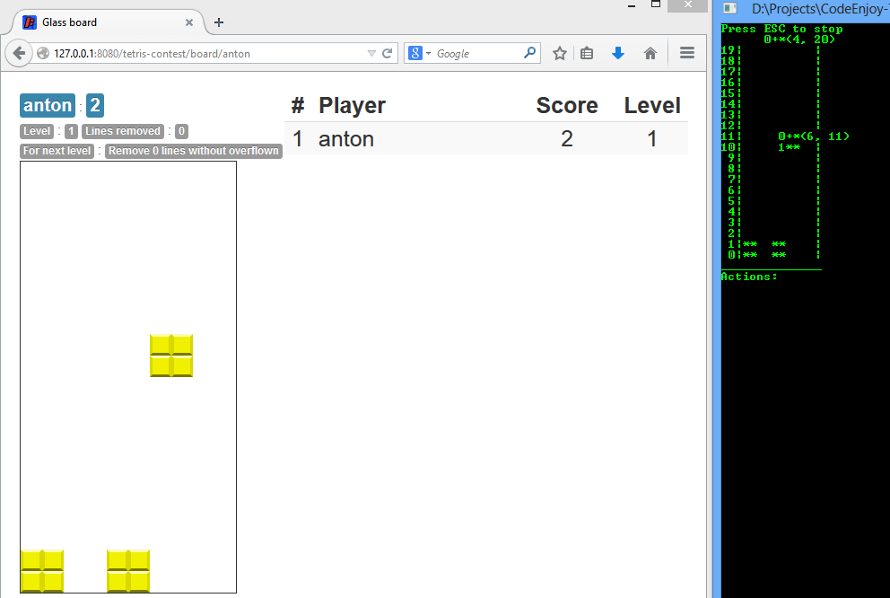

Code Enjoy - Websocket Client
===================

## Описание

Это .net клиент для подключения к серверу CodEnjoy. (http://codenjoy.com/)
Пока что клиент может подключаться только по протоколу **websocket**.

### Доступные игровые оболочки

* Tetris

Quick Start 
===================

## Необходимое программное обеспечение

* Visual Studio с возможностью создания проектов для .Net Framework 4.0 и более
* Nuget package manager - http://docs.nuget.org/docs/start-here/installing-nuget

## Установка Клиента

Скачайте исходники проекта из репозитория и откройте единственный солюшн, скомпилируйте его, вот и все. Настройку смотрите дальше.

**ИЛИ**

1. Открыть студию
2. Создать проект с консольным приложением
3. Установить nuget package с клиентом
  * Установка через Package Manager Console ( http://docs.nuget.org/docs/start-here/using-the-package-manager-console )
    1. Открыть Package Manager Console, и запустить команду:
    2. Install-Package AV.CodeEnjoy.Client -IncludePrerelease
  * Установка через Package Manager GUI ( http://docs.nuget.org/docs/start-here/managing-nuget-packages-using-the-dialog )
    1. Открыть Package Manager Dialog
    2. Перейти во вкладку Online
    3. В верхней части диалога выбрать опцию: **Include Prerelease**
    4. В поле поиска ввести строку AV.CodeEnjoy.Client
    5. Установить найденый пакет

## Настройка клиента

  1. Открыть Program.cs
  2. Поменять Connection Options для того чтобы они соответствовали вашему серверу (настройки можно взять у организатора мероприятия), это:
    * имя игрового сервера
    * игровой порт
    * идентификатор игры
    * имя пользователя в игре
  3. Заменить имя пользователя Anton на имя пользователя с которым вы собираетесь зарегистрироваться в игре.
  4. Запустите приложение - в консольном окне вы должны увидеть игру тетрис, которая является отражением того что происходит на сервере. Для управления можно использовать клавиши со стрелками и клавишу пробел для поворота.
  5. Пример игрового сервера ( http://codenjoy.com/tetris-contest/ )

Игра Tetris
========

## Описание

Суть игры состоит в наборе максимального количества очков, где самое большое количество очков дается за составление "линий".

### Взаимодействие между клиентом и сервером

За один такт игры, сервер передает клиенту следующую информацию:
1. Содержание стакана в который падают фигуры
2. Текущую фигуру, которая падает в стакан и ее положение в стакане
3. Массив фигур, которые будут падать в стакан после текущей

В ответ на такой запрос от сервера, клиент должен выдать действия, которые нужно совершить над фигурой: напр. повернуть, сдвинуть влево или в право на N позиций, а также фигуру можно бросить.

> Для того чтобы написать собственную логику общения с сервером, вам нужно открыть класс: TetrisGameProcessor.cs и полностью заменить логику в методе ProcessTick, который должен изменять объект Figure так как данные об его изменении будут отправлены в ответ серверу. Пример такого поведения можно увидеть в реализации-примере  

### Работа с игровыми объектами

Для простоты взаимодействия с сервером, были написаны вспомогательные объекты упрощающие взаимодействие с сервером. Эти объекты находятся в сборке AV.CodeEnjoy.Tetris.Core.

* Game - содержит информацию приходящую с сервера в виде объектов (см. описание выше), а также отвечает за то из какого объекта взять ответ для сервера.
* Glass - содержит информацию о стакане: 
  * Размеры
  * Заполненные ячейки (битовая таблица, по которой можно понять состояние определенной ячейки занята/свободна)
* Figure - содержит информацию о фигуре:
  * FigureType - тип фигуры
  * Location - положение фигуры
  * Методы позволяющие воздействовать на фигуру
  * Другие вспомогательные свойства
  * GetFigureMask - позволяет получить битовую маску текущего положения фигуры, относительно своей оси

> Используйте тестовый консольный проект для того чтобы больше изучить поведение игры и вспомогательных объектов (для этого используйте класс TetrisConsoleVisualizer.cs). 

**Здесь можно увидеть, что: ** 
* размеры стакана: 10*20
* дно стакана имеет индекс 0
* колонки идут с лева на право
* фигура падает начиная со строки с индексом 20 и падает до дна стакана
* точка являющеся - точкой вращения фигуры помечена знаком '+'

## Ссылка на вебсайт проекта с более детальной информацией
http://codenjoy.com/portal/?p=170

